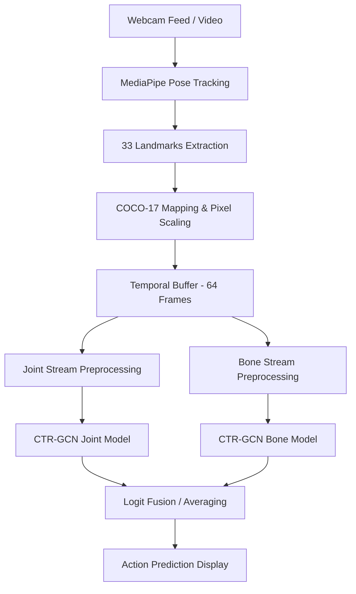
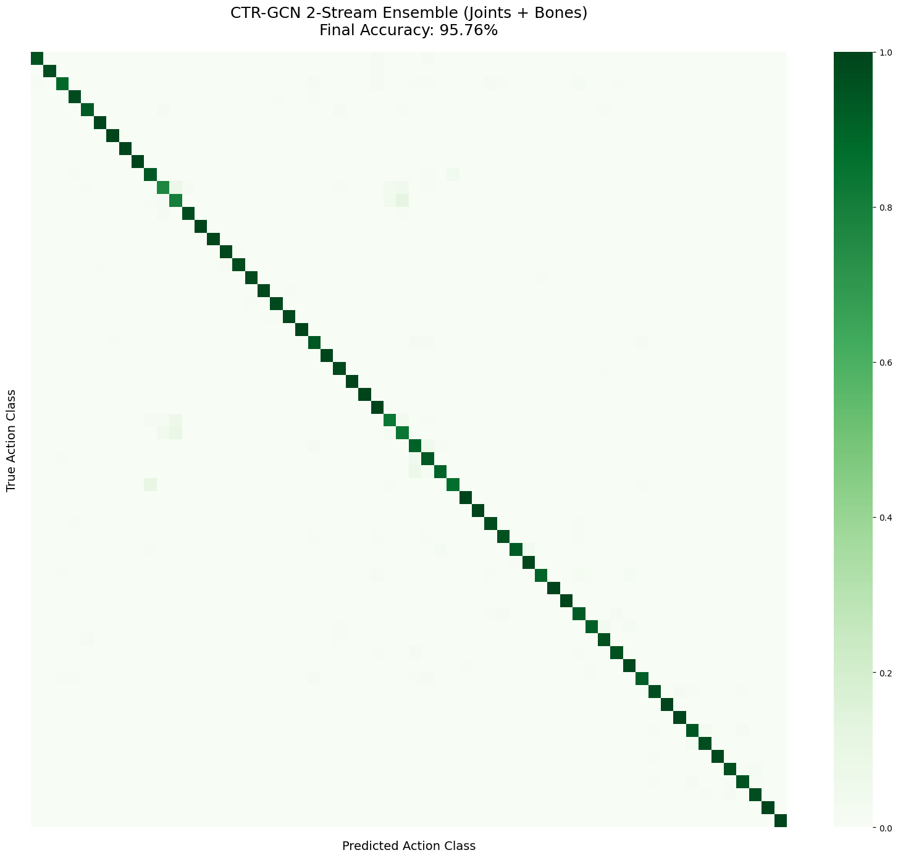

# 🏃‍♂️ Human Action Recognition with CTR-GCN


A high-performance spatial-temporal action recognition system leveraging **Channel-wise Topology Refinement Graph Convolutional Networks (CTR-GCN)**. This project enables real-time recognition of 60 different action classes from the **NTU RGB+D** dataset using a lightweight 2-stream ensemble (Joint + Bone) integrated with MediaPipe pose tracking.

---

## 📝 Problem Statement
Traditional action recognition often relies on heavy 3D-CNNs or simplistic LSTMs that struggle to capture the complex, non-physical relationships between human joints across time. This system addresses the challenge by using **Adaptive Graph Convolutions** that dynamically learn skeletal topology, allowing the model to focus on the most relevant joint interactions (e.g., hand-to-head movements for "drinking") regardless of physical connectivity.

---

## 📊 Dataset
The model is trained on the **NTU RGB+D 60** dataset, specifically using the **HRNet-extracted skeleton** format.
- **Classes:** 60 Actions (e.g., drinking, waving, falling, staggering).
- **Format:** 2D Skeletons (COCO-17 format) extracted via HRNet from the original RGB videos.
- **Source:** [Skeleton Dataset NTU-RGB+D 60 (Kaggle)](https://www.kaggle.com/datasets/namanjain321/skeleton-dataset-ntu-rgbd60)

---

## 🏗️ Methodology

The system operates as a real-time pipeline that transforms a raw video stream into high-confidence action predictions.



### Technical Highlights:
1.  **Channel-wise Topology Refinement:** Unlike standard GCNs, CTR-GCN learns a unique adjacency matrix for every channel, refining the spatial features more granularly.
2.  **2-Stream Ensemble:** Combines raw joint positions (spatial) with bone vectors (structural) to provide a more holistic representation of movement.
3.  **Sliding Window Inference:** Uses a 64-frame sliding window to maintain high temporal resolution while ensuring low-latency real-time feedback.

---

## ⚙️ Model Details & Hyperparameters

The model was trained using the following configuration:

| Hyperparameter | Value |
| :--- | :--- |
| **Backbone** | CTR-GCN |
| **Input Channels** | 2 (X, Y) |
| **Max Frames** | 64 |
| **Batch Size** | 64 |
| **Epochs** | 80 |
| **Learning Rate** | 1e-3 (Cosine Annealing) |
| **Dropout** | 0.3 |
| **Weight Decay** | 1e-4 |

---

## 📈 Results & Performance

The **CTR-GCN 2-Stream Ensemble** achieves state-of-the-art accuracy on the NTU-60 test set, significantly outperforming the Bidirectional LSTM baseline.

| Metric | Score |
| :--- | :--- |
| **Test Accuracy** | **95.76%** |
| **Macro Avg Precision** | 95.85% |
| **Weighted Avg F1-Score** | 95.77% |

### Confusion Matrix


---

## 📂 Project Structure

| File / Folder | Purpose |
| :--- | :--- |
| `inference.py` | Main real-time inference script with MediaPipe and 2-stream ensemble logic. |
| `notebooks/building_model.ipynb` | Training scripts, architecture definitions, and evaluation metrics. |
| `models/` | Local storage for weights and dataset pkl files. |
| `outputs/` | Classification reports and performance visualizations. |
| `requirements.txt` | Project dependencies. |

---

## 🚀 Installation & Setup

### 1. Clone the Repository
```bash
git clone https://github.com/your-username/human-action-recognition.git
cd human-action-recognition
```

### 2. Download Models & Dataset
- **Models:** Download the pre-trained Joint and Bone weights from [Hugging Face](https://huggingface.co/naman-jain7/skeleton-har-ntu60-ctrgcn-2stream) and place them in the `models/` folder.
- **Dataset:** Download `ntu60_hrnet.pkl` from [Kaggle](https://www.kaggle.com/datasets/namanjain321/skeleton-dataset-ntu-rgbd60).

### 3. Setup Environment
```bash
python -m venv .venv
source .venv/bin/activate  # Windows: .venv\Scripts\activate
pip install -r requirements.txt
```

---

## 💻 Usage

### Real-Time Inference
To run the action recognition system on your live webcam feed:
```bash
python inference.py
```
- **Quit:** Press `q` while the video window is active.
- **Models:** The script automatically looks for `best_ctr_gcn_joints.pth` and `best_ctr_gcn_bones.pth` in the `models/` folder.

---

## 🛠️ Tech Stack
- **Core:** Python 3.10+
- **Deep Learning:** PyTorch
- **Computer Vision:** OpenCV, MediaPipe
- **Data Science:** NumPy, Pandas, Scikit-learn
- **Visualization:** Matplotlib, Seaborn

---

## 🔮 Future Work
- **3-Stream Fusion:** Integrating Joint-Motion and Bone-Motion streams for improved velocity sensitivity.
- **Edge Deployment:** Quantizing the model for deployment on mobile or edge devices (e.g., Jetson Nano).
- **Confidence-Aware Mapping:** Improving the Mediapipe-to-COCO mapping by leveraging landmark confidence scores during the preprocessing stage.